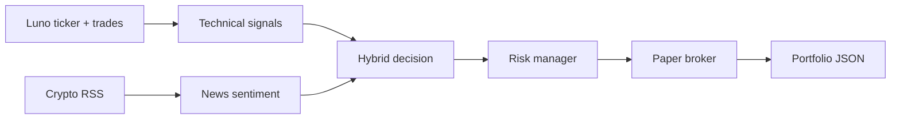

# Crypto Agent Trader

Paper-trading crypto agent for **R2,500** on **Luno** ZAR pairs. Hybrid strategy: **technical entries** (EMA, RSI, breakout) filtered by **news sentiment**. Spot-style paper fills (1x — Luno has no leverage).

**This is paper mode only — no Luno API keys required for market data + simulated trades.**

## Quick start

```powershell
cd C:\Users\stjoh\Projects\crypto-agent-trader
python -m venv .venv
.\.venv\Scripts\pip install -r requirements.txt

# One cycle (analyze + paper trade on Luno prices)
.\.venv\Scripts\python cli.py run

# Portfolio status
.\.venv\Scripts\python cli.py status

# Continuous loop (every 5 min)
.\.venv\Scripts\python cli.py loop

# Live dashboard (browser)
.\.venv\Scripts\python cli.py dashboard
# -> http://127.0.0.1:5055
```

## Configuration

Edit [`config.yaml`](config.yaml):

| Setting | Default | Meaning |
|---------|---------|---------|
| `capital.starting_zar` | 2500 | Your paper bankroll (ZAR) |
| `trading.symbols` | XBTZAR, ETHZAR | Luno pairs |
| `leverage.max` | 1 | Spot only (matches Luno) |
| `risk.max_position_pct` | 0.25 | Max 25% equity per trade |
| `risk.stop_loss_pct` | 0.02 | 2% stop loss |
| `risk.max_daily_loss_pct` | 0.10 | Halt after 10% daily loss |

## Strategy



**Buy:** EMA cross / breakout / oversold bounce + news sentiment not too negative  
**Block buy:** News sentiment below -0.4  
**Sell:** Bearish technical signal, stop-loss, take-profit, or panic news exit  

## Luno notes

- Prices and OHLC come from Luno public API (`/ticker`, `/trades`)
- Official candles need auth — we build candles from recent public trades (~24h)
- No real orders are placed
- Live trading later needs a Luno API key with trading permission

## Data files

- `data/portfolio.json` — positions, cash, PnL (ZAR)
- `data/trades.jsonl` — trade log

## Going live (later)

Not implemented. Requires Luno API keys, separate risk review, and smaller size. Paper first.
